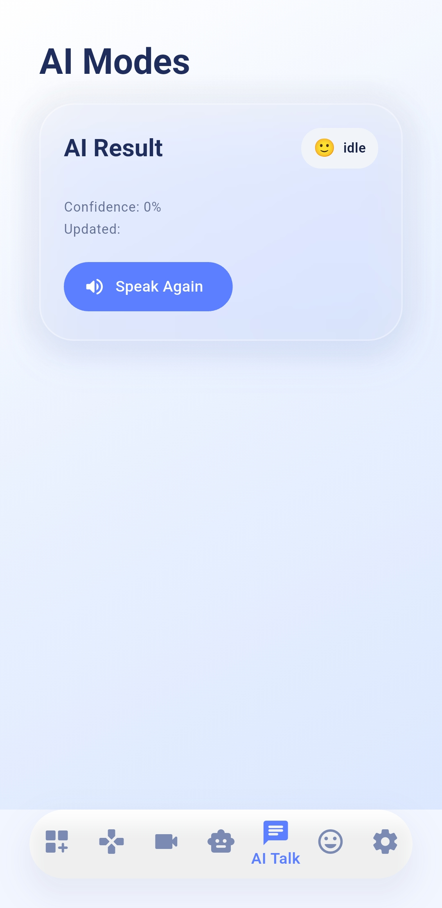
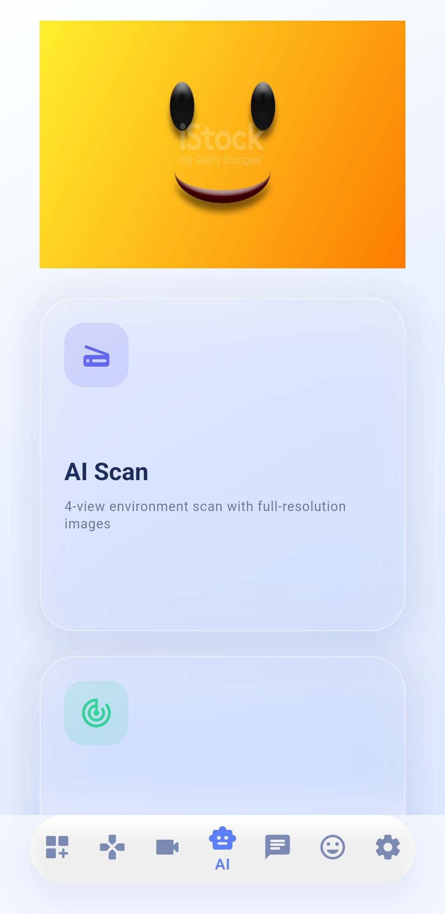
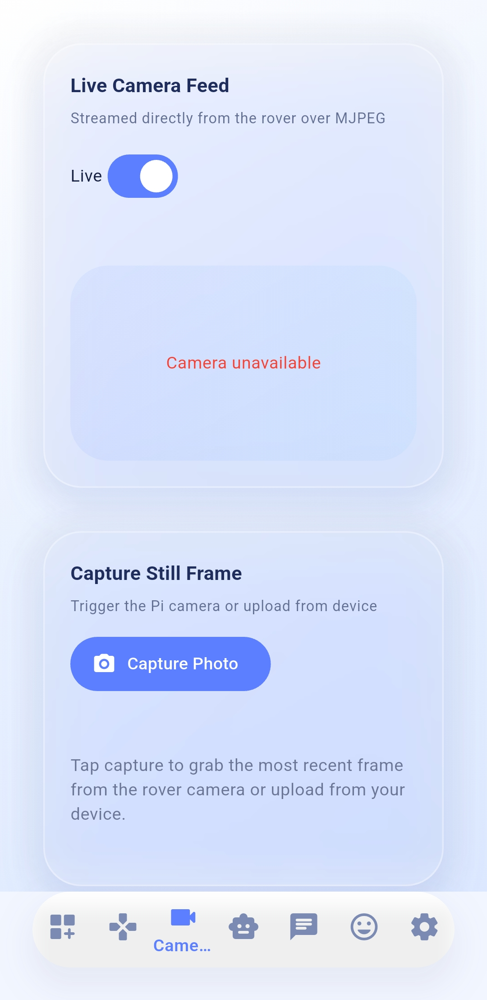

# 🤖 Companion Robot  
### An AI-Powered Interactive Robot Using Raspberry Pi and Edge LLMs

🔗 **Live Web App:**  
https://flutter-ml-web.web.app

---

## 📘 Abstract

**Companion Robot** is an AI-powered interactive robotic system designed to operate entirely offline using edge-based intelligence. Compact enough to fit on a desk, the system integrates speech recognition, computer vision, and distance sensing through a Raspberry Pi without relying on cloud infrastructure.

Voice commands are captured via an onboard microphone and processed locally using Large Language Models (LLMs). Visual perception is provided by a camera module, while spatial awareness and collision avoidance are achieved using ultrasonic distance measurement. All computation occurs on-device, ensuring low latency, enhanced privacy, and uninterrupted operation.

The robot provides real-time feedback through an integrated display and audio output. This project demonstrates how affordable hardware combined with efficient AI pipelines can enable autonomous, privacy-preserving robotic assistants.

---

## 🎯 Objectives

- Enable **fully offline AI interaction**
- Achieve **real-time perception and response**
- Ensure **safe autonomous navigation**
- Provide **web-based control via Flutter**
- Maintain **modular and scalable architecture**

---

## 🧠 System Architecture

Companion Robot follows a **layered architecture**, ensuring clean separation of hardware interaction, processing logic, and intelligence.

### 🔁 High-Level Data Flow Diagram
---

## 🧩 Architectural Layers

### 1️⃣ Input Layer
- **Microphone:** Captures speech commands.
- **Camera Module:** Supplies real-time visual data.
- **Ultrasonic Sensor:** Computes distance using echo timing.

---

### 2️⃣ Processing Layer
Implemented in **Python with Flask**, this layer:
- Converts speech to text
- Normalizes sensor signals
- Routes commands between UI and AI
- Maintains real-time API communication

---

### 3️⃣ Intelligence Layer (Edge LLM)
- Runs **locally (offline)** using LM Studio
- Performs:
  - Natural language understanding
  - Scene and object analysis
  - Contextual decision-making
  - Emotion classification

---

### 4️⃣ Output & Feedback Layer
- **Speaker:** AI-generated speech output
- **Display:** System state and responses
- **Motors:** Physical movement execution
- **Flutter Web UI:** Control, logs, and visualization

---

## 🛠️ Hardware Components

| Component | Description |
|--------|------------|
| Raspberry Pi 4 Model B | Central processing unit |
| Camera Module | Visual perception |
| Ultrasonic Sensor (HC-SR04) | Obstacle detection |
| Microphone | Voice input |
| Speaker | Audio output |
| 3.5″ Touch Display | Visual feedback |
| Motor Driver + Motors | Locomotion |
| Regulated Power Supply | Stable power delivery |

---

## 💻 Software Stack

- **Frontend:** Flutter (Web/Desktop)
- **Backend:** Python, Flask, Socket.IO
- **AI Engine:** LM Studio (Local LLMs)
- **Vision:** OpenCV
- **Speech:** Web Speech API / PyAudio
- **Hardware Control:** GPIO
- **OS:** Raspberry Pi OS

---

## ⚙️ Flask-Based Control Logic (Conceptual)

The Flask server acts as the **central coordination unit**.

Fail-safe logic ensures immediate stop or slowdown when obstacles are detected.

---

## 🎭 Emotion & Interaction System

- Emotion mapping from AI responses
- Fullscreen emotion playback
- Duplicate-emotion prevention
- Automatic return to idle state

This enhances human-robot interaction quality.

---

## 🖥️ Flutter Web Interface

### Features
- Manual control dashboard
- AI chat interface
- Auto Mode hotkey
- Live logs & diagnostics
- Network configuration UI
- Desktop full-screen support

## 🎮 Control Interface Overview

### 🕹️ Manual Control Panel

🔼 **Forward**  
Move the rover forward with controlled acceleration.

◀️ **Left**  
Rotate or steer left precisely.

⏹️ **Stop**  
Immediately halts all movement.

▶️ **Right**  
Rotate or steer right.

🔽 **Reverse**  
Moves the rover backward safely.

---

### ⚡ Quick Actions

🔄 **Rotate 90°**  
Performs a precise quarter-turn rotation.

🔁 **Rotate 180°**  
Reverses direction using a half-turn rotation.

🛑 **Emergency Stop**  
Overrides all commands and forces a safe halt.

🎤 **Voice Command**  
Activates offline speech-based AI control.

---

### 🗣️ Voice Prompt System

Text prompts can be entered manually and transmitted directly to the Raspberry Pi speaker.  
Voice commands are processed **locally** using the onboard AI pipeline.

---

### 📡 Live Telemetry Monitoring

Real-time system telemetry is displayed during operation, allowing the operator to monitor rover state, diagnostics, and safety conditions while issuing commands.

> 💡 **Design Principle:**  
> The interface is inspired by mission-command dashboards, emphasizing safety, clarity, and immediate operator awareness without reliance on keyboard input.

---
## 🧩 Interactive UI & System Visualization

---

## 🗺️ System Data Flow (Visual Diagram Card)

**Purpose:**  
This flow ensures *real-time, offline intelligence* with minimal latency and maximum safety.

---

## 🧠 Auto Mode Interface

### 🤖 Auto Mode (AI-Driven Control)

Auto Mode enables autonomous behavior using **local AI reasoning and sensor fusion**.

**Capabilities:**
- Continuous environment scanning
- Voice-initiated task execution
- Obstacle-aware motion control
- Emotion-synchronized responses

**Safety Behavior:**
- Ultrasonic distance monitoring
- Automatic slow-down in congested areas
- Emergency stop override at all times

> Auto Mode always yields priority to manual or emergency commands.

---

## 📡 Live Telemetry Panel

### 📊 Real-Time System Telemetry

| Metric | Description |
|------|------------|
| CPU Load | Current Raspberry Pi processing usage |
| Temperature | Live system thermal state |
| Distance (cm) | Ultrasonic obstacle measurement |
| Network Status | API connectivity health |
| Motor State | Active / Idle / Emergency Stop |

Telemetry updates continuously while commands are executed, ensuring operator awareness and system transparency.

---

## 🎭 Emotion System UI

### 😊 Emotion & Expression Engine

The Companion Robot uses an **emotion-mapped response system** to enhance interaction.

**Emotion Triggers:**
- AI response classification
- System states (idle, thinking, alert)
- Voice interaction outcomes

**UI Behavior:**
- Fullscreen emotion playback
- Duplicate emotion prevention
- Automatic fallback to idle state

**Examples:**
- 😊 *Happy* → Joke or positive response  
- 🤔 *Thinking* → Scanning or processing  
- 🚨 *Alert* → Obstacle detected  

This system improves clarity, relatability, and human-robot communication.

---

## 🎯 Design Philosophy

The Command Center UI follows **mission-control principles** — prioritizing safety, clarity, and immediate feedback while eliminating unnecessary complexity.

## 🔒 Safety & Reliability

- Ultrasonic obstacle avoidance
- Speed reduction near objects
- Emergency stop mechanism
- Manual override priority
- Non-blocking asynchronous execution

---

## 📸 Application Screenshots

<table align="center">
<tr>

<td align="center" style="border:1px solid #e5e7eb; border-radius:16px; padding:12px;">
  
<b>Manual Control Panel</b> 
Directional and emergency controls
</td>

<td align="center" style="border:1px solid #e5e7eb; border-radius:16px; padding:12px;">
  
<b>AI Chat Interface</b> 
Offline command & response system
</td>

</tr>
</table>

 

<table align="center">
<tr>

<td align="center" style="border:1px solid #e5e7eb; border-radius:16px; padding:12px;">
  
<b>Auto Mode Active</b> 
AI-driven autonomous behavior
</td>

<td align="center" style="border:1px solid #e5e7eb; border-radius:16px; padding:12px;">
  
<b>Camera Preview</b> 
Real-time vision input for AI
</td>

</tr>
</table>

 

<table align="center">
<tr>

<td align="center" style="border:1px solid #e5e7eb; border-radius:16px; padding:12px;">
  
<b>Emotion Display</b> 
AI emotion-based visual feedback
</td>

<td align="center" style="border:1px solid #e5e7eb; border-radius:16px; padding:12px;">
  
<b>Desktop Full-Screen View</b> 
Optimized wide-screen layout
</td>

</tr>
</table>

---

## 🧪 Methodology

1. Capture user input
2. Preprocess locally
3. Interpret using LLM
4. Apply safety constraints
5. Execute action
6. Provide feedback
7. Log system state

---

## 🚀 Applications

- Educational robotics
- Offline AI assistants
- Human-robot interaction research
- Privacy-preserving AI systems
- Smart automation demos

---

## 📈 Future Scope

- Follow-me mode
- Patrol / guard mode
- Face recognition (optional)
- Expanded emotion library
- Multi-language interaction

---

## 📄 Disclaimer

This project is developed for **educational and experimental purposes**.  
Proper safety measures must be followed during physical deployment.

---

⭐ *Companion Robot demonstrates the feasibility of intelligent, private, and autonomous edge-AI robotics using affordable hardware.*

